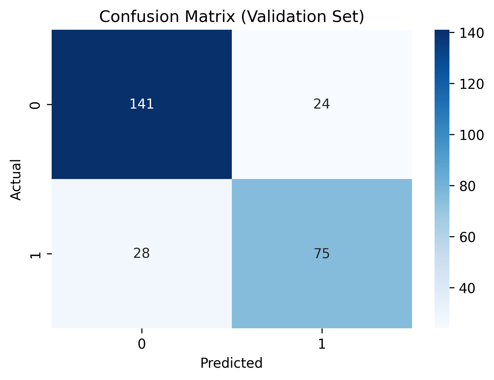

/---

# 🚢 Titanic Survival Prediction using Logistic Regression

This project demonstrates a complete machine learning workflow using **Logistic Regression** to predict Titanic passengers' survival based on their demographic and travel information. The model is built using **scikit-learn** and visualized using **Matplotlib** and **Seaborn**.

---

## 📂 Project Structure

```bash
titanic_survival_prediction/
├── train.csv
├── test.csv
├── submission.csv
├── confusion_matrix.png
├── titanic_model.py
├── README.md
```

---

## 📊 Model Overview

* **Algorithm:** Logistic Regression
* **Data Source:** Kaggle Titanic Dataset
* **Target Variable:** `Survived`
* **Features Used:**

  * Pclass
  * Sex
  * Age
  * SibSp
  * Parch
  * Fare
  * Embarked

---

## 📈 Confusion Matrix (Validation Set)

This confusion matrix represents model performance on the validation set:



---

## 📋 Steps Performed

1. **Data Cleaning**

   * Filled missing `Age` and `Fare` with median.
   * Dropped `Cabin` due to excessive missing values.
   * Filled missing `Embarked` with 'S'.

2. **Feature Encoding**

   * Label Encoding applied to `Sex` and `Embarked`.

3. **Scaling**

   * Features scaled using `MinMaxScaler`.

4. **Model Training**

   * Split data using `train_test_split`.
   * Logistic Regression model trained on the cleaned dataset.

5. **Evaluation**

   * Accuracy, F1 Score, and Confusion Matrix used for evaluation.
   * Confusion Matrix plotted and saved.

6. **Prediction**

   * Final predictions generated on `test.csv`.
   * Results saved as `submission.csv`.

---

## 📊 Key Results

| Metric             | Value          |
| ------------------ | -------------- |
| Accuracy (Val Set) | \~81% (approx) |
| F1 Score           | \~0.73         |

---

## 📦 Requirements

* Python 3.x
* pandas
* numpy
* scikit-learn
* matplotlib
* seaborn

Install via:

```bash
pip install pandas numpy scikit-learn matplotlib seaborn
```

---

## 🚀 Running the Project

```bash
python main.py
```

This will:

* Train the model.
* Output evaluation metrics.
* Save:

  * `submission.csv` with final predictions.
  * `confusion_matrix.png` visualization.

---

## 📄 Submission

* Submit `submission.csv` to [Kaggle Titanic Competition](https://www.kaggle.com/c/titanic).

---

